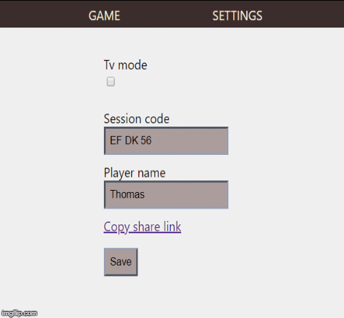

## Scrum Poker Online


Play scrum poker online with your scrum team. Simply join an existing session or create a new session code and share it with your team members.


[**Click to play scrum poker online**](https://scrum-poker-31315.web.app/)

Build with [firestorable](https://github.com/thdk/firestorable).



# Contribute

## Firebase project

Create a new firebase project or ask another contributor to join an existing firebase project.

## Configure firebase project

Create a `.env` file with your firebase secrets from the firebase console.

```
# .env
REACT_APP_FIREBASE_API_KEY=
REACT_APP_FIREBASE_PROJECT_ID=
REACT_APP_FIREBASE_AUTH_DOMAIN=
```

Then start the application without using any firbase emulators.

```sh
npm run start
```

## Available scripts

In the project directory, you can run:
### `npm start`

Runs the app in the development mode.<br />
Open [http://localhost:3000](http://localhost:3000) to view it in the browser.

The page will reload if you make edits.<br />
You will also see any lint errors in the console.

Note: if your are using the 'auto config' setup mentioned above, you must have the emulator running in another terminal.

### `npm run emulators`
This will start the firebase **hosting** and **firestore** emulator.

### `npm test`

Launches the test runner in the interactive watch mode.<br />
See the section about [running tests](https://facebook.github.io/create-react-app/docs/running-tests) for more information.

### `npm run build`

Builds the app for production to the `build` folder.<br />
It correctly bundles React in production mode and optimizes the build for the best performance.

The build is minified and the filenames include the hashes.<br />
Your app is ready to be deployed!

See the section about [deployment](https://facebook.github.io/create-react-app/docs/deployment) for more information.

### `npm run deploy`

Builds the app for production and deploys it to firebase hosting site if a site is configured in the firebase console for the project.

### `npm run serve`
Similator to `npm run emulators` but this one will only start the hosting emulator so that firestore request will be made to the real firestore data.

## Credits

<a href="https://iconscout.com/icons/game" target="_blank">Game Icon</a> by <a href="https://iconscout.com/contributors/mcgandhi61">Mohit Gandhi</a> on <a href="https://iconscout.com">Iconscout</a>